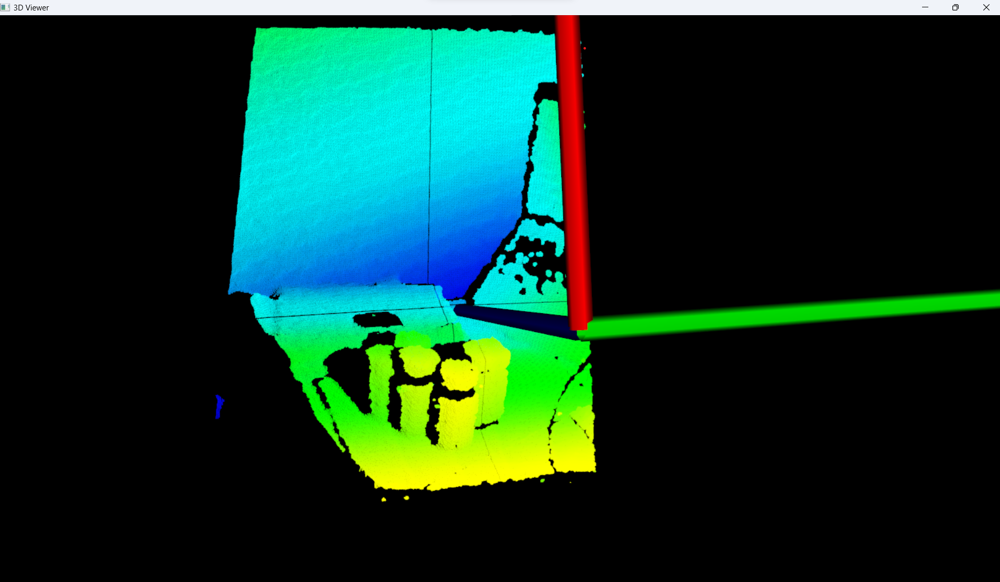

# L210u-L215u-LIPSedge

This repository is for the [L215u/L210u](https://www.lips-hci.com/lipsedge-l-series) camera, a **Structured Light(SL)** camera.

## Preparation

L215u / L210u SDK can be downloaded: [here](https://www.lips-hci.com/developer-documentation)

Opencv 3+ and PCL 1.8+ is also required, you can download [OpenCV 3.4.15](https://1drv.ms/u/s!AnRiouA_fmTVio1mOv8-MCdmQGeioA?e=0Pmvm2) which is compiled with vs2107 with **riz** module. 

A 3D model and the user guide can be found [here](https://1drv.ms/u/s!AnRiouA_fmTVio1pBDSnGv3wmKzpww?e=ANDTGC).

## Run

Please make sure 'camera_parameters.txt' is placed in your workspace.

``` bash
# for L215u
saved_directory_name test
#saved_format should be only bin/txt/auto
saved_format auto
#ms
interval_time 500
auto_number 120
```

## Screenshot

<p align="center">
  
</p>
