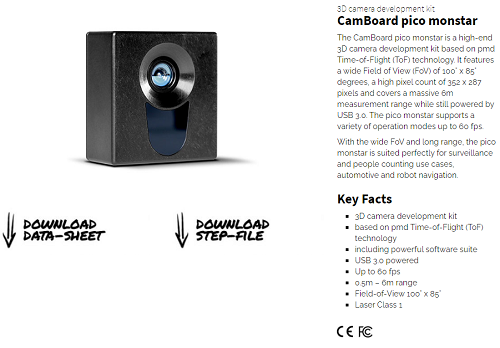
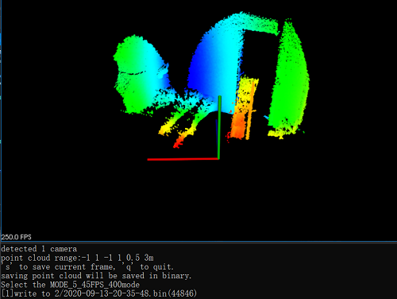

# PMDCamera (Pico Monstar)

[**Pico Monstar**](https://pmdtec.com/picofamily/monstar/) is a Time-of-Flight (ToF) camera, which can capture 3D data and up to 60fps and is easy to deploy for your applications as well.

It should be noted that this repository is an unofficial guideline but a doable practice for the use of a PMD camera, **Pico Monstar**. A 3D model and office guidelines can be found in [Document](./Document) folder.

<p align="center">
  
</p>

## Requirements for development

- PCL 1.8 +
- Royale SDK (provided by [pico_monstar](https://pmdtec.com/picofamily/monstar/), which can be retrieved from official website.

Here, 3.23 and 4.22 versions of the RoyaleSDK are provided: [RoyaleSDK_3.23](https://1drv.ms/u/s!AnRiouA_fmTVio1l2b-qfWXoRU4lnA?e=S1jZzw) and [RoyaleSDK_4.22](https://1drv.ms/u/s!AnRiouA_fmTVio1kp4R1T6GU50FV1w?e=YebfKL) 

## Run

*Only Tested on **Windows 10***

Please make sure "camera_parameters.txt" is placed in the same directory, as

``` bash
# 0: indoor room reconstruction, MODE_9_5FPS_1900
# 1: Room scanning indoor navigation, MODE_9_10FPS_900
# 2: 3D object reconstruction, MODE_9_15FPS_600
# 3: Medium size object recognition or face reconstruction, MODE_9_25FPS_300
# 4: Remote collaboration, MODE_5_35PFS_500
# 5: Small object, MODe_5_45FPS_400
# 6: Hand tracking, MODE_5_60FPS
# 7: Mixed Mode
# 8: Mixed Mode
# 9: low noise extended
# 10: Fast acquisition
# 11: very fast acquisition
operate_mode 1
min_x -0.6
max_x 0.6
min_y 0.0
max_y 0.4
min_z 0.1
max_z 1.1
saved_directory_name today_saved
#saved_format only has bin/txt/auto
saved_format bin
#ms
interval_time 100
```

## Screenshot

<p align="center">
  
</p>
