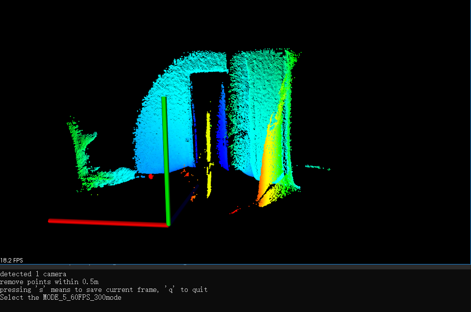

# PMDCamera

Retrieve point cloud or depth image using PMD camera(pico_monstar)

## Requirements

- PCL 1.8.1+

## Get&Show point cloud using PMD camera



When the key `S` is pressed, a current point cloud will be named after the date and time, and then saved in `./`.

``` shell
detected 1 camera
Select the MODE_5_60FPS_300mode
write to 2020-08-07-18-34-26.bin(72368)
```
