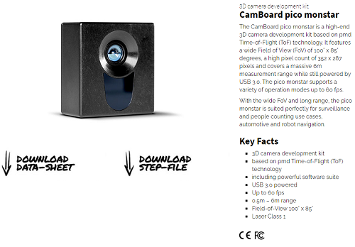

# PMDCamera (Pico Monstar)

[**Pico Monstar**](https://pmdtec.com/picofamily/monstar/) is a Time-of-Flight (ToF) camera, which can capture 3D data and up to 60fps, and is easy to deploy for your applications as well. 

It should be noted that this repository is not an official guideline but a doable and practice for use of a PMD camera, specifically, the **Pico Monstar**. Regarding to technical specification, please click [here](./specifications) or official website to know more details.

<p align="center">
  
</p>

## Requirements for development

- PCL 1.8.1+ (for visualization)
- Royale SDK (provided by [pico_monstar](https://pmdtec.com/picofamily/monstar/), if you can not download try to find in "./Specification/*" folder)

## Running (on windows)

``` python

# please run following these parameters as below:
PMD_camera.exe min_x max_x min_y max_y min_z max_z saved_directory_name saved_format[bin/txt/auto] interval_time(ms, only for auto)

# For example:
# filter with "-0.6 0.6 0.0 0.4 0.1 1.1", and all data will be saved with .bin, a format that is space saved. 100 is ignored
PMD_Camera.exe -0.6 0.6 0.0 0.4 0.1 1.1 today_saved bin 100

# filter with "-0.6 0.6 0.0 0.4 0.1 1.1", and all data will be saved with .txt, a format that can be readable by Notepad. 100 is ignored
PMD_Camera.exe -0.6 0.6 0.0 0.4 0.1 1.1 today_saved_2 txt 100

# filter with "-0.6 0.6 0.0 0.4 0.1 1.1", and all data will be saved with .txt and .bin per 100 milesecond.
PMD_Camera.exe -0.6 0.6 0.0 0.4 0.1 1.1 today_saved_2 auto 100

# here is the output:
detected 1 camera
Select the MODE_5_60FPS_300mode
write to 2020-08-07-18-34-26.bin(72368)
```

<p align="center">
  
</p>
