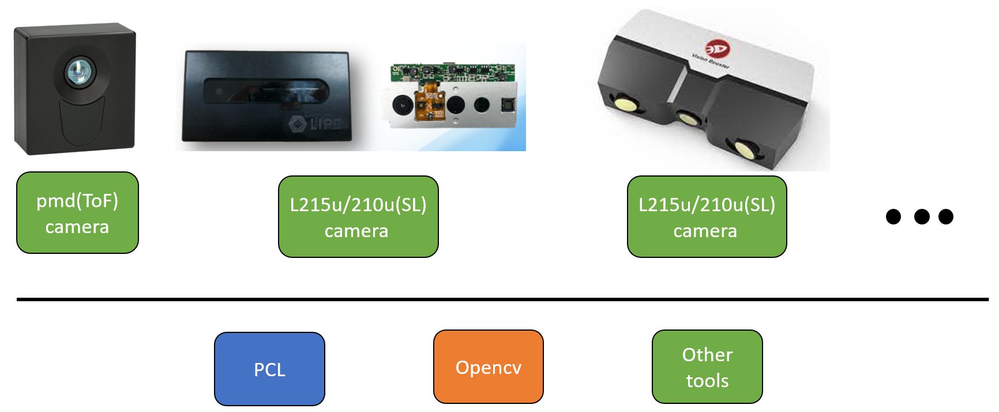

# 3DCamera Development Kit

This repository is a guideline for students and researchers to use 3D cameras in the Robotics Laboratory at Aarhus University, Denmark. We now support the following 3D cameras:

- Pico Monstar, a **Time of Flight (ToF)-based** camera from [pmd tech](https://3d.pmdtec.com/en/).
- LIPSedge L215u/L210u, a **Structured Light(SL)-based** camera, from [LIPS](https://www.lips-hci.com/).
- VBI-5M-400, a **Structured Light(SL)-based** industrial camera, from [VST](https://visen.jinchan18.com/).

# Content

Click these folder to know your camera:
- [L210u-L215u-LIPSedge](./L210u-L215u-LIPSedge)
- [Pico-Monstar-PMD](./Pico-Monstar-PMD)
- [VisionBooster](./VisionBooster)

## Framework
The framework of this work is depicted as 

  

